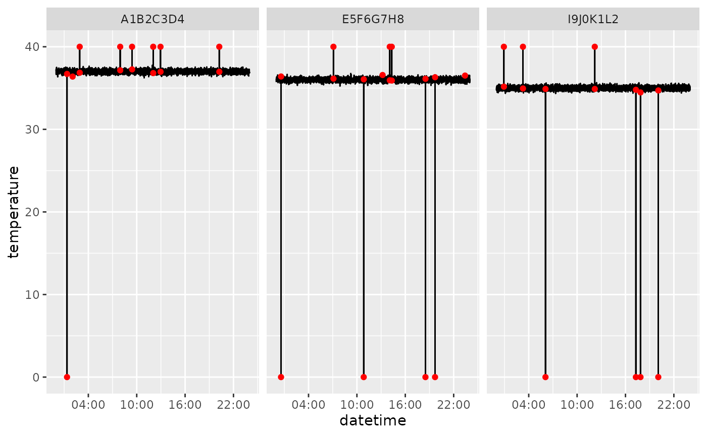
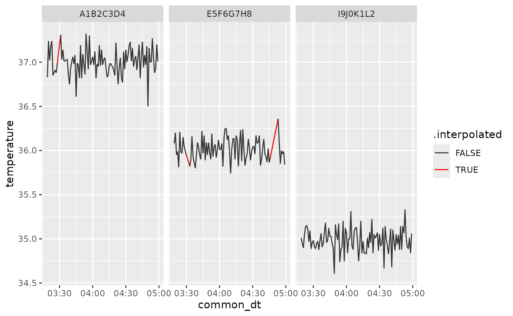

# Step by Step UID Workflow

This vignette walks through processing a single UID CSV file using the
functions in `uid`. A small example dataset is bundled with the package,
and serves to illustrate how the package works.

``` r
library(uid)
```

## 1. Reading raw data

``` r
file_path <- "path_to_your_data.csv"
# this will read and clean names, switch the datetime to proper datetime
raw <- read_raw_uid_csv(file_path)
```

The cleaning workflow assumes that each `rfid` maps to a single
`matrix_name` within a session. In practice, duplicate matrix detections
usually reflect mistakes such as matrices being placed too close to each
other or a cage being briefly placed on the wrong platform.

When
[`clean_raw_uid()`](https://matiasandina.github.io/uid/reference/clean_raw_uid.md)
detects the same `rfid` on more than one matrix, it prints a summary
table with `session_name`, `rfid`, `matrix_name`, `n`, `%`, `min_dt`,
and `max_dt`. Low-percentage duplicates can be removed after explicit
confirmation. If duplicate detections on the secondary matrix exceed
10%, processing aborts and the file should be reviewed manually.

The `uid` package provides sample data that emulates the result of
`read_raw_uid_csv`, and we can use it for the tutorial.

``` r
head(uid_sample_data)
#>              datetime     rfid zone   session_name temperature matrix_name
#> 1 2025-01-01 00:00:00 A1B2C3D4    3 sample_session       37.16         MM1
#> 2 2025-01-01 00:00:20 A1B2C3D4    3 sample_session       37.24         MM1
#> 3 2025-01-01 00:00:40 A1B2C3D4    8 sample_session       36.66         MM1
#> 4 2025-01-01 00:01:00 A1B2C3D4    2 sample_session       37.25         MM1
#> 5 2025-01-01 00:01:20 A1B2C3D4    3 sample_session       36.98         MM1
#> 6 2025-01-01 00:01:40 A1B2C3D4    4 sample_session       36.98         MM1
```

## 2. Cleaning and outlier removal

UID raw data export might come with outliers from wrong detections. We
use a simple filter based on point-to-point difference and a threshold.
This approach works well for raw data with fast sampling rate (e.g.,
sampling rate lesser than 1 minute) and it’s implemented via
[`flag_temperature_outliers()`](https://matiasandina.github.io/uid/reference/flag_temperature_outliers.md).
If your data comes from a slow sampling rate (e.g., sampling rate in the
tens of minutes), this approach might not be the best to remove
outliers.

``` r
# jumps of more than one degree will be counted as outliers
flagged <- flag_temperature_outliers(uid_sample_data, threshold = 1)
# remove temperature outliers
clean <- dplyr::filter(flagged, !outlier_global)
```

You can visualize the flagged outliers with
[`plot_outliers()`](https://matiasandina.github.io/uid/reference/plot_outliers.md).
This will save the plots to specific locations.

``` r
plot_outliers(flagged, output_dir = tempdir(), filepath = file_path)
```

For the purpose of this tutorial, we will plot the results here instead
of saving them to file.

``` r
# example for flagged
ggplot2::ggplot(flagged, ggplot2::aes(datetime, temperature, group=rfid)) +
  ggplot2::geom_line() +
  ggplot2::geom_point(
    data = flagged |> dplyr::filter(outlier_global),
    ggplot2::aes(datetime, temperature),
    color = "red"
  ) +
  ggplot2::facet_wrap(~rfid) +
  ggplot2::scale_x_datetime(date_breaks = "6 hours", date_labels = "%H:%M")
```



## 3. Activity calculation

Activity calculation is performed using the known distance between the
induction coil zones as given by the `zone` column in the raw data
export. You can check the zones with

``` r
uid:::.zone_coords
#> # A tibble: 8 × 3
#>    zone     x     y
#>   <int> <dbl> <dbl>
#> 1     1  0     0   
#> 2     2  3.62  0   
#> 3     3  7.25  0   
#> 4     4 10.9   0   
#> 5     5 10.9   3.16
#> 6     6  7.25  3.16
#> 7     7  3.62  3.16
#> 8     8  0     3.16
```

Euclidean distance calculations are therefore defined by the transitions
from one zone to another. For example transitioning from zone 4 to zone
1 is a movement of 10.875000 inches.

``` r
head(uid:::.transition_distances)
#>   from to activity_index
#> 1    1  1       0.000000
#> 2    2  1       3.625000
#> 3    3  1       7.250000
#> 4    4  1      10.875000
#> 5    5  1      11.324806
#> 6    6  1       7.908736
```

> 🚧 Please make sure you are using the same platforms if you plan to
> use
> [`calculate_activity()`](https://matiasandina.github.io/uid/reference/calculate_activity.md)

The function
[`calculate_activity()`](https://matiasandina.github.io/uid/reference/calculate_activity.md)
uses the `.transition_distances` as a transition dictionary for
platforms with 8 zones.

``` r
with_activity <- calculate_activity(clean)
```

## 4. Downsampling and interpolation

The sample data is provided with a sample interval of 20 seconds.
Because the timestamp that comes with real data detections will not be
the same for different `rfid`, there will not be a common timestamp
across `rfid`. This may or might not be a problem for different
analysis, but it is also often desired to aggregate the data on longer
intervals (e.g., 1 or 5 minutes). Using `downsample_temperature` or
[`downsample_activity()`](https://matiasandina.github.io/uid/reference/downsample_activity.md),
we can aggregate the data with precision of 1 minute. A feature of this
is that the operation is performed by `rfid` (and other desired grouping
variables). As a result, will have all `rfid` sampled at the same
downsampled `common_time`.

``` r
down_temp <- downsample_temperature(with_activity, n = 1, precision = "minute")
down_act  <- downsample_activity(with_activity, n = 1, precision = "minute")
merged <- dplyr::left_join(
  down_temp, down_act,
  by = c("session_name", "rfid", "common_dt", "matrix_name")
)
```

Data acquisition might generate `NA` values that survive downsampling.
We included some of such gaps in the sample data.

``` r
dplyr::filter(merged, is.na(temperature))
#> # A tibble: 37 × 7
#>    session_name rfid  matrix_name common_dt           temperature activity_index
#>    <chr>        <chr> <chr>       <dttm>                    <dbl>          <dbl>
#>  1 sample_sess… A1B2… MM1         2025-01-01 03:28:00          NA             NA
#>  2 sample_sess… A1B2… MM1         2025-01-01 03:29:00          NA             NA
#>  3 sample_sess… A1B2… MM1         2025-01-01 03:30:00          NA             NA
#>  4 sample_sess… A1B2… MM1         2025-01-01 17:30:00          NA             NA
#>  5 sample_sess… A1B2… MM1         2025-01-01 17:31:00          NA             NA
#>  6 sample_sess… A1B2… MM1         2025-01-01 17:32:00          NA             NA
#>  7 sample_sess… A1B2… MM1         2025-01-01 17:33:00          NA             NA
#>  8 sample_sess… A1B2… MM1         2025-01-01 17:34:00          NA             NA
#>  9 sample_sess… A1B2… MM1         2025-01-01 17:35:00          NA             NA
#> 10 sample_sess… A1B2… MM1         2025-01-01 17:36:00          NA             NA
#> # ℹ 27 more rows
#> # ℹ 1 more variable: .flicker_corrected <lgl>
```

It might be desired to interpolate such `NA`s using
[`interpolate_gaps()`](https://matiasandina.github.io/uid/reference/interpolate_gaps.md).
We can set `add_flag = TRUE` to check what values were interpolated.

``` r
interp <- merged |>
  dplyr::group_by(rfid, session_name, matrix_name) |>
  interpolate_gaps(
    max_gap = 10,
    target_cols = c("temperature", "activity_index"),
    add_flag = TRUE
  )
```

``` r
dplyr::filter(interp, .interpolated) |> 
  dplyr::select(rfid, common_dt, temperature, .interpolated)
#> # A tibble: 37 × 4
#>    rfid     common_dt           temperature .interpolated
#>    <chr>    <dttm>                    <dbl> <lgl>        
#>  1 A1B2C3D4 2025-01-01 03:28:00        37.0 TRUE         
#>  2 A1B2C3D4 2025-01-01 03:29:00        37.1 TRUE         
#>  3 A1B2C3D4 2025-01-01 03:30:00        37.2 TRUE         
#>  4 A1B2C3D4 2025-01-01 17:30:00        37.0 TRUE         
#>  5 A1B2C3D4 2025-01-01 17:31:00        37.0 TRUE         
#>  6 A1B2C3D4 2025-01-01 17:32:00        37.0 TRUE         
#>  7 A1B2C3D4 2025-01-01 17:33:00        37.0 TRUE         
#>  8 A1B2C3D4 2025-01-01 17:34:00        37.0 TRUE         
#>  9 A1B2C3D4 2025-01-01 17:35:00        37.0 TRUE         
#> 10 A1B2C3D4 2025-01-01 17:36:00        37.0 TRUE         
#> # ℹ 27 more rows
```

By increasing the `max_gap` parameter, we will be interpolating larger
gaps.

We can visualize the results of the interpolation by slicing a portion
of the dataset to make the linear interpolation more evident.

``` r
ggplot2::ggplot(interp |> dplyr::slice(200:300, .by = rfid), ggplot2::aes(common_dt, temperature, group=rfid, color = .interpolated)) +
  ggplot2::geom_line() +
  ggplot2::facet_wrap(~rfid) +
  ggplot2::scale_x_datetime(date_breaks = "30 min", date_labels = "%H:%M")+
  ggplot2::scale_color_manual(values = c("TRUE" = "red", "FALSE" = "gray20"))
```



The `interp` data frame now holds cleaned, downsampled values with short
gaps interpolated. For processing multiple files automatically, see the
vignette on
[`process_all_uid_files()`](https://matiasandina.github.io/uid/reference/process_all_uid_files.md)
or
([`help("process_all_uid_files")`](https://matiasandina.github.io/uid/reference/process_all_uid_files.md)).
